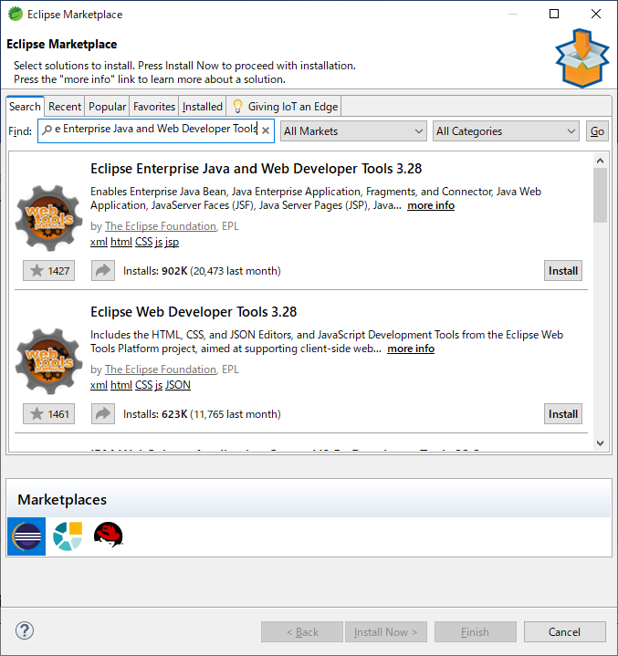
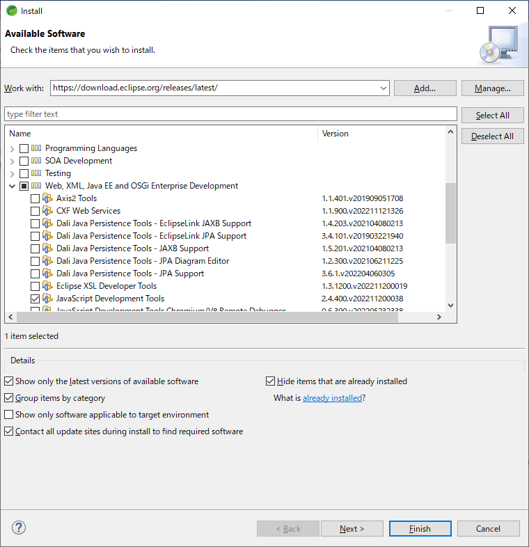
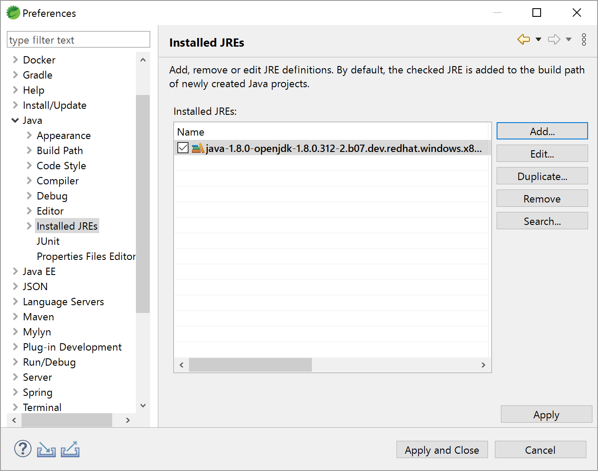
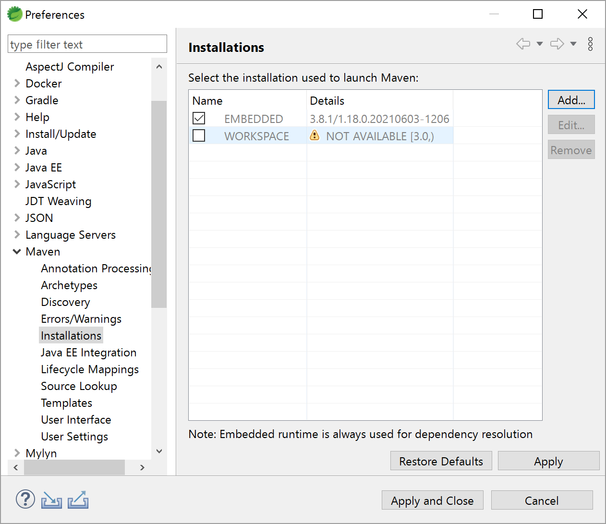
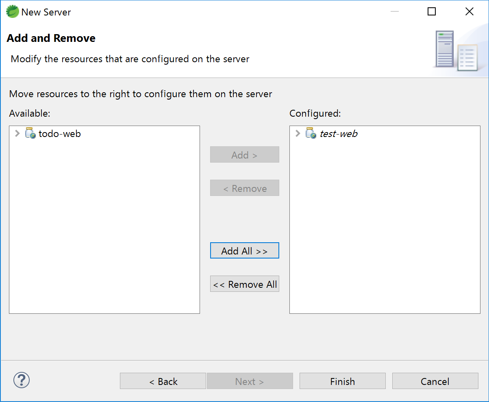
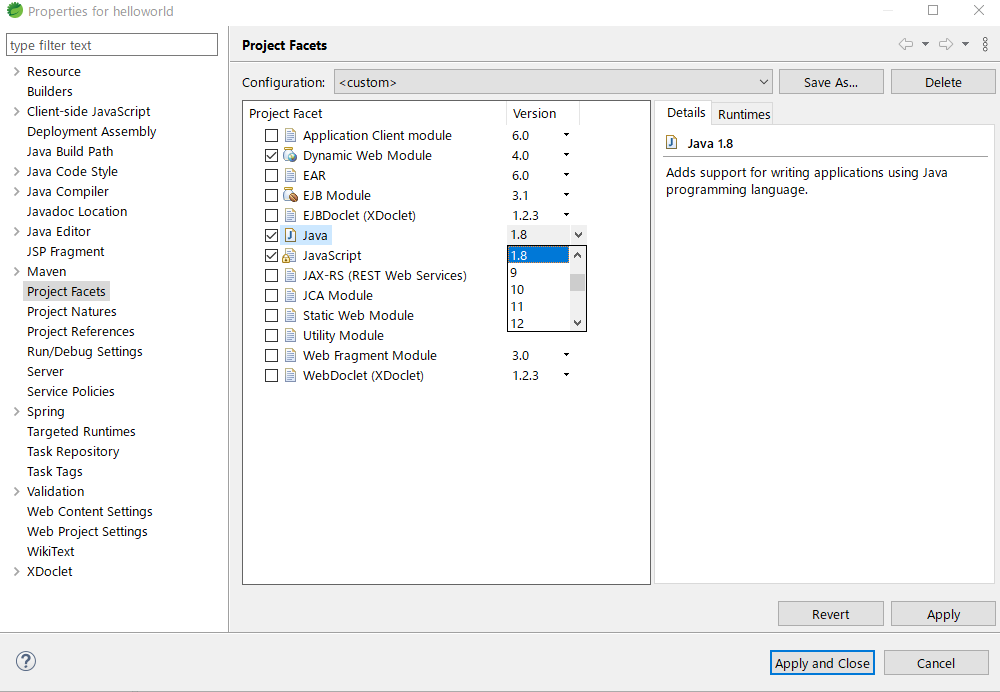
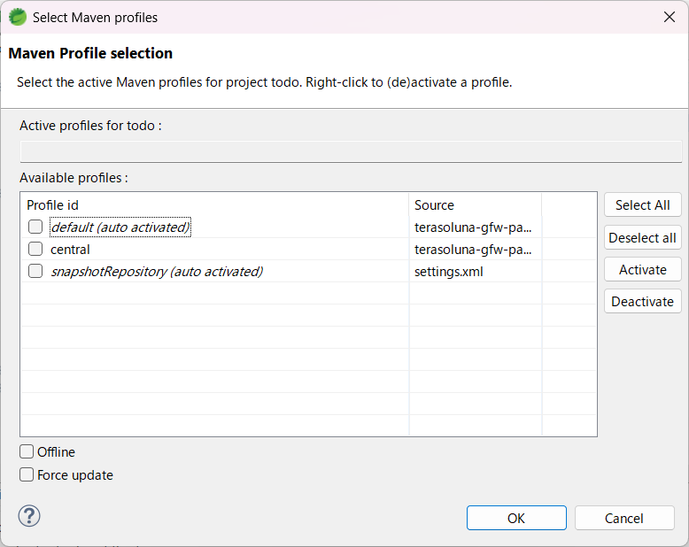
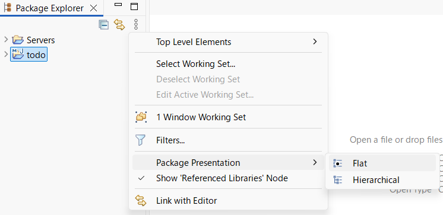

STSの設定手順
================================================================================

.. only:: html

.. contents:: 目次
  :depth: 3
  :local:

|

| Spring Tool Suite(以降STSと呼ぶ)とは、EclipseをベースにSpringでの開発に適した機能が組み込まれている統合開発環境である。
| 本章では\ |framework_name|\で解説するアプリケーション開発に適した設定方法について解説する。

なお、以降の解説はJava、Maven及びアプリケーションサーバーがインストールされていることを前提としている。これらのインストール手順については各自で調査されたい。

|

.. _SpringToolSuiteWhatIsSTS:

Spring Tool Suite とは
--------------------------------------------------------------------------------

| STSはSpring Bootでの開発に適したツールとして作成されている。
| Spring Bootを使用しないSpringアプリケーション開発に対しては不足している機能があるため、不足部分の補完方法についてこの章で解説していく。

|

.. _SpringToolSuiteInstalling:

STSの導入手順
--------------------------------------------------------------------------------

.. _SpringToolSuiteInstallingIDE:

STSの導入
^^^^^^^^^^^^^^^^^^^^^^^^^^^^^^^^^^^^^^^^^^^^^^^^^^^^^^^^^^^^^^^^^^^^^^^^^^^^^^^^
| STS本体は\ :url_spring_io:`STSの公式ページ </tools>`\ から取得することができる。
| 過去のバージョンのSTSを使用したい場合は\ :url_sts_github:`STSのGitHub <>`\ からダウンロードされたい。

なお、以下で紹介する導入手順はWindowsを前提としているため注意されたい。

ダウンロードした「spring-tools-for-eclipse-xxx.zip」を任意のフォルダに展開する。
展開されたフォルダ内の「SpringToolsForEclipse.exe」を実行することでSTSを起動することができる。

|

.. _SpringToolSuiteInstallingPlugin:

プラグインの導入
^^^^^^^^^^^^^^^^^^^^^^^^^^^^^^^^^^^^^^^^^^^^^^^^^^^^^^^^^^^^^^^^^^^^^^^^^^^^^^^^
| STSには従来のJakarta EE（Java EE）Webアプリケーション開発向けのWeb Tools Platform (WTP)やJSPエディタなどが搭載されていない、従来のSpring アプリケーション開発向けのXML形式のBean定義ファイルがサポートされていない等、\ |framework_name|\ で解説するアプリケーション開発に必要な機能が不足している。

| プラグインの導入はEclipse Marketplace経由で行う。
| STSのメニューから、Help > EclipseMarketplaceを選択し、以下のプラグインを導入する。

* Eclipse Enterprise Java and Web Developer Tools

  Webアプリ開発用のプラグイン(WTP)やJSPエディタを使用するために必要なプラグイン。

.. _SpringToolSuiteProxySettings:

.. note::

  プロキシ環境下でプラグインを導入する場合、プロキシ設定を行わないとEclipse MarketPlaceに接続できずプラグインを導入することができない。

  プロキシ設定は以下の手順で行える。

  * STSのメニューから、Window > Preferences > General > Network Connections からプロキシ設定を開き、Active ProviderをManualにしてHTTPとHTTPSにプロキシを設定する。

  .. figure:: ./images_SpringToolSuite/SpringToolSuiteProxy.png
    :alt: SpringToolSuite Proxy Settings
    :align: center
    :width: 50%

|

.. _SpringToolSuiteAdvanceSettings:

作業用の事前設定
--------------------------------------------------------------------------------

.. _SpringToolSuiteJavascriptEditorSettings:

JavaScriptのエディタ設定
^^^^^^^^^^^^^^^^^^^^^^^^^^^^^^^^^^^^^^^^^^^^^^^^^^^^^^^^^^^^^^^^^^^^^^^^^^^^^^^^
| eclipse 2020-06リリース以降、JavaScript用に使用されるエディタがJavaScript DevelopmentTools(以降JSDTと呼ぶ)で提供されていたJavaScript Editorから、Eclipse Wild Web Developerというプラグインで提供されるGeneric Text Editor（もしくは普通のText Editor）に変更されている。
| この影響でformatter.xmlを使用してのJavaScriptのフォーマットが行えないため、以下の手順でJSDTを導入する必要がある。

1. STSのメニューから、Help > Install New Softwareを選択し、Work withに「\ ``https://download.eclipse.org/releases/latest/``\ 」を入力する。
2. Web,XML,Java EE and OSGi Enterprise Development > JavaScript Development Tools を選択し、インストールを行う。

.. note::

  JSDTのインストール後、再起動を行うことで自動的に.jsファイルをJavaScript Editorで開くようになる。自動的に切り替わらない場合は、STSのメニューから、Window > Preferences > General > Editors > File Associations を開き、\*.jsファイルに対してJavaScript Editorを関連付ける。

|

.. _SpringToolSuiteJavaSettings:

Java設定
^^^^^^^^^^^^^^^^^^^^^^^^^^^^^^^^^^^^^^^^^^^^^^^^^^^^^^^^^^^^^^^^^^^^^^^^^^^^^^^^
| STSの設定によっては予め用意したJDKではなくSTSに同梱されているJDKなどが使用される場合があるので、以下の手順でJDKの設定を確認する。

1. STSのメニューから、Window > Preferences > Java > Installed JREs を開き、予め用意したJDKにチェックがついていることを確認する。
2. 用意したJDKが一覧に存在しない場合は AddからStandard VMを選択し、Directoryから用意したJDKを選択し追加する。

|

.. _SpringToolSuiteMavenSettings:

Maven設定
^^^^^^^^^^^^^^^^^^^^^^^^^^^^^^^^^^^^^^^^^^^^^^^^^^^^^^^^^^^^^^^^^^^^^^^^^^^^^^^^
| STSはデフォルトだとSTSに同梱されたMavenを使用するため、以下の手順で予め用意したMavenを使用するよう設定する。

1. Window > Preferences > Maven > Installations からAddを選択し、Directoryから用意したMavenを選択し追加する。

|

.. _SpringToolSuiteServerSettings:

Server設定
^^^^^^^^^^^^^^^^^^^^^^^^^^^^^^^^^^^^^^^^^^^^^^^^^^^^^^^^^^^^^^^^^^^^^^^^^^^^^^^^
| 以下の手順でアプリケーションサーバの追加を行う。
| ここでは例としてTomcatを使用する場合の設定手順について説明する。

1. Window > Show View > Other... > Server > Servers を選択し、Serverビューを表示する。
2. Serverビューを右クリックし、New > Serverを選択する。
3. Apache配下から使用しているTomcatのバージョンと一致するTomcatを選択しNextを押下する。
4. Browseから事前にインストールしておいたtomcatを選択し、Finishを押下する。
5. サーバにアプリケーションを設定したい場合は、追加したサーバを右クリックしてAdd and Removeを選択する。表示された画面のAvailableにある動作させたいアプリケーションを選択し、AddでConfiguredに追加してFinishを押下する。
6. アプリケーションを設定したサーバを右クリックし、Startを選択してサーバを起動する。

|

.. _SpringToolSuiteJavaVersion:

Javaバージョンが異なる場合の対応
--------------------------------------------------------------------------------

| 本ガイドラインで説明しているプロジェクトをインポートした際に、期待したJavaバージョンのJRE System Libraryを参照しない場合がある。
| これは、STSが起動時に使用するJavaバージョンや事前に準備されたプロジェクトが参照するmaven-compiler-pluginやJDKアクティブプロファイルの設定などにより、プロジェクトのJavaバージョンが変更されてしまうためである。
| ここでは、一時的にプロジェクトの設定を変更し、期待したJavaバージョンで動作させる方法を紹介する。ただし、一時的な手段であるため、設定変更やUpdate Maven Projectの実行などにより元に戻る点に注意されたい。

|

Project Facetsの設定
^^^^^^^^^^^^^^^^^^^^^^^^^^^^^^^^^^^^^^^^^^^^^^^^^^^^^^^^^^^^^^^^^^^^^^^^^^^^^^^^

| Project FacetsのJavaバージョンを変更することにより、プロジェクトが参照するJRE System Libraryを変更することができる。
| マルチプロジェクトの場合は、各プロジェクト毎に設定する必要がある。

1. プロジェクトを右クリック > Properties > Project Facets を選択し、Javaのバージョンを変更する。

|

Maven Profileの設定
--------------------------------------------------------------------------------

Maven Profileが設定されている場合、適切に切り替えることにより、状況に応じた設定にすることが可能となる。

1. プロジェクトを右クリック > 「Maven」->「Select Maven Profiles…」をクリックし、設定するプロファイルを選択して「OK」ボタンを押下する。

プロジェクトによりMaven Profileの設定は異なるため、各プロジェクトのpom.xmlを参照し、適切に設定を変更されたい。

|

STSの操作方法
--------------------------------------------------------------------------------

STSの操作方法について知っていると便利なものについて説明する。

|

パッケージの表示形式
^^^^^^^^^^^^^^^^^^^^^^^^^^^^^^^^^^^^^^^^^^^^^^^^^^^^^^^^^^^^^^^^^^^^^^^^^^^^^^^^

パッケージの表示形式は、デフォルトは「Flat」だが、「Hierarchical」にしたほうが見通しがよい。

Package Explorerの「View Menu」 (右端の3点リーダー)をクリックし、「Package Presentation」->「Hierarchical」を選択する。

Package PresentationをHierarchicalにすると、以下の様な表示になる。

.. tabs::
  .. group-tab:: Java Config

     .. figure:: ./images_SpringToolSuite/presentation-hierarchical-view_JavaConfig.png

  .. group-tab:: XML Config

     .. figure:: ./images_SpringToolSuite/presentation-hierarchical-view_XMLConfig.png

.. raw:: latex

  \newpage
