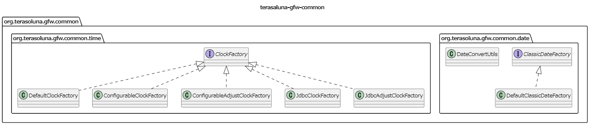
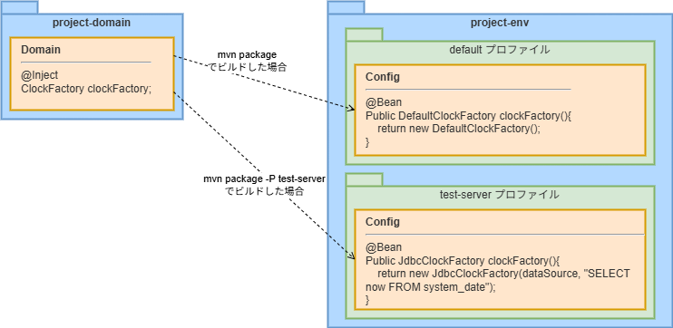

システム時刻
================================================================================

.. only:: html

.. contents:: 目次
  :depth: 3
  :local:

|

Overview
--------------------------------------------------------------------------------

| アプリケーションのシステム日時は、実行環境のOSのシステム時刻ではなく、開発・運用側で任意の日時に設定可能であることが望ましい。
| 本節では、共通ライブラリが提供しているシステム時刻を取得するためのコンポーネントについて説明する。

|

共通ライブラリから提供しているコンポーネントについて
^^^^^^^^^^^^^^^^^^^^^^^^^^^^^^^^^^^^^^^^^^^^^^^^^^^^^^^^^^^^^^^^^^^^^^^^^^^^^^^^

共通ライブラリでは、システム時刻を取得するためのコンポーネントを提供している。

共通ライブラリから提供しているコンポーネントは、terasoluna-gfw-commonから以下の2つの機能を提供している。

* \ ``java.util.Date``\ を生成するDate Factory
* \ ``java.time.Clock``\ を生成するClock Factory

コンポーネントのクラス図を以下に示す。

|

提供しているインタフェース
""""""""""""""""""""""""""""""""""""""""""""""""""""""""""""""""""""""""""""""""

以下に、terasoluna-gfw-commonのコンポーネントとして提供しているインタフェースについて説明する。

.. tabularcolumns:: |p{0.35\linewidth}|p{0.65\linewidth}|
.. list-table::
  :header-rows: 1
  :widths: 35 65

  * - インタフェース
    - 説明
  * - | org.terasoluna.gfw.common.date.
      | ClassicDateFactory
    - Javaから提供されている以下のクラスのインスタンスをシステム時刻として取得するためのインタフェース。

      * \ ``java.util.Date``\
      * \ ``java.sql.Timestamp``\
      * \ ``java.sql.Date``\
      * \ ``java.sql.Time``\

      共通ライブラリでは、本インタフェースの実装クラスとして以下のクラスを提供している。

      * \ ``org.terasoluna.gfw.common.date.DefaultClassicDateFactory``\
  * - | org.terasoluna.gfw.common.time.
      | ClockFactory
    - Javaから提供されている以下のクラスのインスタンスをシステム時刻として取得するためのインタフェース。

      * \ ``java.time.Clock``\

      共通ライブラリでは、本インタフェースの実装クラスとして以下のクラスを提供している。

      * \ ``org.terasoluna.gfw.common.time.DefaultClockFactory``\
      * \ ``org.terasoluna.gfw.common.time.ConfigurableClockFactory``\
      * \ ``org.terasoluna.gfw.common.time.ConfigurableAdjustClockFactory``\
      * \ ``org.terasoluna.gfw.common.time.JdbcClockFactory``\
      * \ ``org.terasoluna.gfw.common.time.JdbcAdjustClockFactory``\

      \ **本ガイドラインでは、本インタフェースに対応する実装クラスを使用することを推奨する。**\

|

ClockFactoryの実装クラス
""""""""""""""""""""""""""""""""""""""""""""""""""""""""""""""""""""""""""""""""

\ ``ClockFactory``\ インタフェースの実装クラスをbean定義ファイルに定義し、\ ``ClockFactory``\ のインスタンスをJavaクラスにインジェクションして使用する。

実装クラスは使用用途に応じて、以下から選択する。

.. tabularcolumns:: |p{0.30\linewidth}|p{0.30\linewidth}|p{0.40\linewidth}|
.. list-table::
  :header-rows: 1
  :widths: 30 30 40

  * - クラス名
    - 概要
    - 備考
  * - | org.terasoluna.gfw.common.time.
      | DefaultClockFactory
    - | システム・デフォルトのClockを取得する。
    - | 
  * - | org.terasoluna.gfw.common.time.
      | ConfigurableClockFactory
    - | 指定した固定日時から生成したClockを取得する。
    - | 
  * - | org.terasoluna.gfw.common.time.
      | ConfigurableAdjustClockFactory
    - | システム・デフォルトのClockに指定した差分を加算したClockを取得する。
    - | 
      | 
  * - | org.terasoluna.gfw.common.time.
      | JdbcClockFactory
    - | DBに登録した固定の時刻から生成したClockを取得する。
    - | このクラスを使用するためには、日時を管理するためのテーブルが必要である。
  * - | org.terasoluna.gfw.common.time.
      | JdbcAdjustClockFactory
    - | システム・デフォルトのClockにDBに登録した差分を加算したClockを取得する。
    - | このクラスを使用するためには、差分値を管理するためのテーブルが必要である。

| 日付を変更する要件が無い場合は\ ``DefaultClockFactory``\ を使用することを推奨する。
| 運用対処などで日時を変更する必要がある場合は、\ ``JdbcAdjustClockFactory``\ を使用し、通常時は差分値を0に設定することを推奨する。

.. caution::

  本番環境で\ ``JdbcAdjustClockFactory``\ を使用する場合は、通常時は参照するテーブルの差分値が0となっていることを\ **必ず確認する**\ こと。

|

How to use
--------------------------------------------------------------------------------

| \ ``ClockFactory``\ インタフェースの実装クラスをbean定義ファイルに定義し、\ ``ClockFactory``\ のインスタンスをJavaクラスにインジェクションして使用する。\ ``ClockFactory``\ からClockを取得する方法については、\ :ref:`SystemDate_get_clock`\ を参照されたい。

| 実装クラスを設定するbean定義ファイルは、環境ごとに切り替えられるように、[projectName]-envに定義することを推奨する。
| \ ``ClockFactory``\ を利用することにより、bean定義ファイルの設定を変更するだけで、ソースを変更せずに日時の変更が可能となる。

|

ClockFactoryのBean定義
^^^^^^^^^^^^^^^^^^^^^^^^^^^^^^^^^^^^^^^^^^^^^^^^^^^^^^^^^^^^^^^^^^^^^^^^^^^^^^^^

以下に、\ ``ClockFactory``\ の実装クラスの定義方法について説明する。

.. _SystemDate_HowToUseDefaultClock:

サーバーのシステム・デフォルトClockを取得する
""""""""""""""""""""""""""""""""""""""""""""""""""""""""""""""""""""""""""""""""

\ ``org.terasoluna.gfw.common.time.DefaultClockFactory``\ を使用する。

\ **bean定義ファイル**\

.. tabs::
  .. group-tab:: Java Config

    - \ ``[projectname]EnvConfig.java``\

      .. code-block:: java

        // (1)
        @Bean
        public DefaultClockFactory clockFactory() {
            return new DefaultClockFactory();
        }

      .. tabularcolumns:: |p{0.10\linewidth}|p{0.90\linewidth}|
      .. list-table::
        :header-rows: 1
        :widths: 10 90
      
        * - 項番
          - 説明
        * - | (1)
          - | \ ``DefaultClockFactory``\ をbean定義する。

  .. group-tab:: XML Config

    - \ ``[projectname]-env.xml``\

      .. code-block:: xml
      
        <!-- (1) -->
        <bean id="clockFactory" class="org.terasoluna.gfw.common.time.DefaultClockFactory" />
      
      .. tabularcolumns:: |p{0.10\linewidth}|p{0.90\linewidth}|
      .. list-table::
        :header-rows: 1
        :widths: 10 90
      
        * - 項番
          - 説明
        * - | (1)
          - | \ ``DefaultClockFactory``\ をbean定義する。

|

指定した固定日時から生成したClockを取得する
""""""""""""""""""""""""""""""""""""""""""""""""""""""""""""""""""""""""""""""""

| \ ``org.terasoluna.gfw.common.time.ConfigurableClockFactory``\ を使用する。
| \ ``ConfigurableClockFactory``\ は、以下の3つのコンストラクタを提供している。

* \ :ref:`日付フォーマットの指定なし <SystemDate_ConfigurableClockFactory_NoPattern>`\  : \ ``ConfigurableClockFactory(String localDateTimeString)``\
* \ :ref:`日付フォーマットの指定あり <SystemDate_ConfigurableClockFactory_WithPattern>`\  : \ ``ConfigurableClockFactory(String localDateTimeString, String pattern)``\
* \ :ref:`Styleでの指定 <SystemDate_ConfigurableClockFactory_FormatStyle>`\  : \ ``ConfigurableClockFactory(String localDateTimeString, FormatStyle dateStyle, FormatStyle timeStyle)``\

|

.. _SystemDate_ConfigurableClockFactory_NoPattern:

日付フォーマットの設定なし
''''''''''''''''''''''''''''''''''''''''''''''''''''''''''''''''''''''''''''''''

\ **bean定義ファイル**\

.. tabs::
  .. group-tab:: Java Config

    - \ ``[projectname]EnvConfig.java``\

      .. code-block:: java

        // (1)
        @Bean
        public ConfigurableClockFactory clockFactory() {
            ConfigurableClockFactory factory = new ConfigurableClockFactory("2012-09-11T02:25:15"); // (2)
            return factory;
        }

      .. tabularcolumns:: |p{0.10\linewidth}|p{0.90\linewidth}|
      .. list-table::
        :header-rows: 1
        :widths: 10 90

        * - 項番
          - 説明
        * - | (1)
          - | \ ``ConfigurableClockFactory``\ をbean定義する。
        * - | (2)
          - | \ ``localDateTimeString``\ プロパティに、固定日時を設定する。
            | 日付フォーマットを設定しない場合、日付フォーマットは\ :url_javase17:`ISO_LOCAL_DATE_TIME </docs/api/java.base/java/time/format/DateTimeFormatter.html#ISO_LOCAL_DATE_TIME>`\ が適用される。
            | そのため、\ :url_javase17:`ISO_LOCAL_DATE_TIME </docs/api/java.base/java/time/format/DateTimeFormatter.html#ISO_LOCAL_DATE_TIME>`\ に合わせ"\ ``2012-09-11T02:25:15``\ "を固定日時として設定している。

  .. group-tab:: XML Config

    - \ ``[projectname]-env.xml``\

      .. code-block:: xml
      
        <!-- (1) -->
        <bean id="clockFactory" class="org.terasoluna.gfw.common.time.ConfigurableClockFactory">
            <!-- (2) -->
            <constructor-arg name="localDateTimeString" value="2012-09-11T02:25:15" />
        </bean>

      .. tabularcolumns:: |p{0.10\linewidth}|p{0.90\linewidth}|
      .. list-table::
        :header-rows: 1
        :widths: 10 90

        * - 項番
          - 説明
        * - | (1)
          - | \ ``ConfigurableClockFactory``\ をbean定義する。
        * - | (2)
          - | \ ``localDateTimeString``\ プロパティに、固定日時を設定する。
            | 日付フォーマットを設定しない場合、日付フォーマットは\ :url_javase17:`ISO_LOCAL_DATE_TIME </docs/api/java.base/java/time/format/DateTimeFormatter.html#ISO_LOCAL_DATE_TIME>`\ が適用される。
            | そのため、\ :url_javase17:`ISO_LOCAL_DATE_TIME </docs/api/java.base/java/time/format/DateTimeFormatter.html#ISO_LOCAL_DATE_TIME>`\ に合わせ"\ ``2012-09-11T02:25:15``\ "を固定日時として設定している。

|

.. _SystemDate_ConfigurableClockFactory_WithPattern:

日付フォーマットの設定あり
''''''''''''''''''''''''''''''''''''''''''''''''''''''''''''''''''''''''''''''''

\ **bean定義ファイル**\

.. tabs::
  .. group-tab:: Java Config

    - \ ``[projectname]EnvConfig.java``\

      .. code-block:: java

        // (1)
        @Bean
        public ConfigurableClockFactory clockFactory() {
            ConfigurableClockFactory factory = new ConfigurableClockFactory("2012/09/11 02:25:15", "uuuu/MM/dd HH:mm:ss"); // (2)(3)
            return factory;
        }

      .. tabularcolumns:: |p{0.10\linewidth}|p{0.90\linewidth}|
      .. list-table::
        :header-rows: 1
        :widths: 10 90
      
        * - 項番
          - 説明
        * - | (1)
          - | \ ``ConfigurableClockFactory``\ をbean定義する。
        * - | (2)
          - | \ ``localDateTimeString``\ プロパティに、固定日時を設定する。
            | この例では日付フォーマットを"\ ``uuuu/MM/dd HH:mm:ss``\ "として定義しているため、指定した日付フォーマットに合わせ"\ ``2012/09/11 02:25:15``\ "を固定日時として設定している。
        * - | (3)
          - | \ ``pattern``\ プロパティに、日付フォーマットを設定する。

  .. group-tab:: XML Config

    - \ ``[projectname]-env.xml``\

      .. code-block:: xml
      
        <!-- (1) -->
        <bean id="clockFactory" class="org.terasoluna.gfw.common.time.ConfigurableClockFactory">
            <!-- (2) -->
            <constructor-arg name="localDateTimeString" value="2012/09/11 02:25:15" />
            <!-- (3) -->
            <constructor-arg name="pattern" value="uuuu/MM/dd HH:mm:ss" />
        </bean>
      
      .. tabularcolumns:: |p{0.10\linewidth}|p{0.90\linewidth}|
      .. list-table::
        :header-rows: 1
        :widths: 10 90
      
        * - 項番
          - 説明
        * - | (1)
          - | \ ``ConfigurableClockFactory``\ をbean定義する。
        * - | (2)
          - | \ ``localDateTimeString``\ プロパティに、固定日時を設定する。
            | この例では日付フォーマットを"\ ``uuuu/MM/dd HH:mm:ss``\ "として定義しているため、指定した日付フォーマットに合わせ"\ ``2012/09/11 02:25:15``\ "を固定日時として設定している。
        * - | (3)
          - | \ ``pattern``\ プロパティに、日付フォーマットを設定する。

|

.. _SystemDate_ConfigurableClockFactory_FormatStyle:

Styleでの指定
''''''''''''''''''''''''''''''''''''''''''''''''''''''''''''''''''''''''''''''''

\ **bean定義ファイル**\

.. tabs::
  .. group-tab:: Java Config

    - \ ``[projectname]EnvConfig.java``\

      .. code-block:: java

        // (1)
        @Bean
        public ConfigurableClockFactory clockFactory() {
            ConfigurableClockFactory factory = new ConfigurableClockFactory("2012/09/11 02:25:15", FormatStyle.MEDIUM, FormatStyle.MEDIUM); // (2)(3)
            return factory;
        }
      
      .. tabularcolumns:: |p{0.10\linewidth}|p{0.90\linewidth}|
      .. list-table::
        :header-rows: 1
        :widths: 10 90
      
        * - 項番
          - 説明
        * - | (1)
          - | \ ``ConfigurableClockFactory``\ をbean定義する。
        * - | (2)
          - | \ ``localDateTimeString``\ プロパティに、固定日時を設定する。
            | この例では日付および時間のStyleを\ ``FormatStyle.MEDIUM``\ として定義しているため、指定した日付スタイルに合わせ"\ ``2012/09/11 02:25:15``\ "を固定日時として設定している。
        * - | (3)
          - | \ ``dateStyle``\ プロパティに日付のStyle、\ ``timeStyle``\ プロパティに時間のStyleを設定する。
            | 入力可能な値は\ :url_javase17:`FormatStyle </docs/api/java.base/java/time/format/FormatStyle.html#enum-constant-detail>`\ を参照されたい。

  .. group-tab:: XML Config

    - \ ``[projectname]-env.xml``\

      .. code-block:: xml
      
        <!-- (1) -->
        <bean id="clockFactory" class="org.terasoluna.gfw.common.time.ConfigurableClockFactory">
            <!-- (2) -->
            <constructor-arg name="localDateTimeString" value="2012/09/11 02:25:15" />
            <!-- (3) -->
            <constructor-arg name="dateStyle" value="#{T(java.time.format.FormatStyle).MEDIUM}" />
            <constructor-arg name="timeStyle" value="#{T(java.time.format.FormatStyle).MEDIUM}" />
        </bean>
      
      .. tabularcolumns:: |p{0.10\linewidth}|p{0.90\linewidth}|
      .. list-table::
        :header-rows: 1
        :widths: 10 90
      
        * - 項番
          - 説明
        * - | (1)
          - | \ ``ConfigurableClockFactory``\ をbean定義する。
        * - | (2)
          - | \ ``localDateTimeString``\ プロパティに、固定日時を設定する。
            | この例では日付および時間のStyleを\ ``FormatStyle.MEDIUM``\ として定義しているため、指定した日付スタイルに合わせ"\ ``2012/09/11 02:25:15``\ "を固定日時として設定している。
        * - | (3)
          - | \ ``dateStyle``\ プロパティに日付のStyle、\ ``timeStyle``\ プロパティに時間のStyleを設定する。
            | 入力可能な値は\ :url_javase17:`FormatStyle </docs/api/java.base/java/time/format/FormatStyle.html#enum-constant-detail>`\ を参照されたい。

|

システム・デフォルトのClockに対し差分を追加したClockを取得する
""""""""""""""""""""""""""""""""""""""""""""""""""""""""""""""""""""""""""""""""

\ ``org.terasoluna.gfw.common.time.ConfigurableAdjustClockFactory``\ を使用する。

\ **bean定義ファイル**\

.. tabs::
  .. group-tab:: Java Config

    - \ ``[projectname]EnvConfig.java``\

      .. code-block:: java

        // (1)
        @Bean
        public ConfigurableAdjustClockFactory clockFactory() {
            ConfigurableAdjustClockFactory factory = new ConfigurableAdjustClockFactory(1, ChronoUnit.DAYS); // (2)(3)
            return factory;
        }
      
      .. tabularcolumns:: |p{0.10\linewidth}|p{0.90\linewidth}|
      .. list-table::
        :header-rows: 1
        :widths: 10 90
      
        * - 項番
          - 説明
        * - | (1)
          - | \ ``ConfigurableAdjustClockFactory``\ をbean定義する。
        * - | (2)
          - | \ ``adjustedValue``\ プロパティに、差分値を設定する。日付時間単位は(3)で決定する。
        * - | (3)
          - | \ ``adjustedValueUnit``\ プロパティに、日付時間単位を設定する。
            | この例では\ ``DAYS``\ を設定しているため、Factoryで生成されるClockはシステムのデフォルトClockに1日加算した日時となる。
            | 設定できる日付時間単位については\ :url_javase17:`ChronoUnit </docs/api/java.base/java/time/temporal/ChronoUnit.html>`\ を参照されたい。
      
            .. note:: 
      
              \ ``adjustedValueUnit``\ プロパティには推定期間を設定することはできない。（例えば、\ ``MONTHS``\ や\ ``YEARS``\ などは設定できない。）
      
              推定期間を設定した場合、以下の様な例外が出力される。
      
                .. code-block:: console
      
                  java.time.temporal.UnsupportedTemporalTypeException: Unit must not have an estimated duration
      
              推定期間かどうかは\ :url_javase17:`ChronoUnitのJavaDoc </docs/api/java.base/java/time/temporal/ChronoUnit.html>`\ を参照されたい。

  .. group-tab:: XML Config

    - \ ``[projectname]-env.xml``\

      .. code-block:: xml

        <!-- (1) -->
        <bean id="clockFactory" class="org.terasoluna.gfw.common.time.ConfigurableAdjustClockFactory">
            <!-- (2) -->
            <constructor-arg name="adjustedValue" value="1" />
            <!-- (3) -->
            <constructor-arg name="adjustedValueUnit" value="#{T(java.time.temporal.ChronoUnit).DAYS}" />
        </bean>
      
      .. tabularcolumns:: |p{0.10\linewidth}|p{0.90\linewidth}|
      .. list-table::
        :header-rows: 1
        :widths: 10 90
      
        * - 項番
          - 説明
        * - | (1)
          - | \ ``ConfigurableAdjustClockFactory``\ をbean定義する。
        * - | (2)
          - | \ ``adjustedValue``\ プロパティに、差分値を設定する。日付時間単位は(3)で決定する。
        * - | (3)
          - | \ ``adjustedValueUnit``\ プロパティに、日付時間単位を設定する。
            | この例では\ ``DAYS``\ を設定しているため、Factoryで生成されるClockはシステムのデフォルトClockに1日加算した日時となる。
            | 設定できる日付時間単位については\ :url_javase17:`ChronoUnit </docs/api/java.base/java/time/temporal/ChronoUnit.html>`\ を参照されたい。
      
            .. note:: 
      
              \ ``adjustedValueUnit``\ プロパティには推定期間を設定することはできない。（例えば、\ ``MONTHS``\ や\ ``YEARS``\ などは設定できない。）
      
              推定期間を設定した場合、以下の様な例外が出力される。
      
                .. code-block:: console
      
                  java.time.temporal.UnsupportedTemporalTypeException: Unit must not have an estimated duration
      
              推定期間かどうかは\ :url_javase17:`ChronoUnitのJavaDoc </docs/api/java.base/java/time/temporal/ChronoUnit.html>`\ を参照されたい。

|

DBに登録した固定の時刻から生成したClockを取得する
""""""""""""""""""""""""""""""""""""""""""""""""""""""""""""""""""""""""""""""""

\ ``org.terasoluna.gfw.common.time.JdbcClockFactory``\ を使用する。

\ **bean定義ファイル**\

.. tabs::
  .. group-tab:: Java Config

    - \ ``[projectname]EnvConfig.java``\

      .. code-block:: java

        // (1)  
        @Bean
        public JdbcClockFactory clockFactory(
                @Qualifier("dataSource") DataSource dataSource) {
            JdbcClockFactory factory = new JdbcClockFactory(dataSource, "SELECT now FROM system_date"); //(2)(3)
            return factory;
        }
      
      .. tabularcolumns:: |p{0.10\linewidth}|p{0.90\linewidth}|
      .. list-table::
        :header-rows: 1
        :widths: 10 90
      
        * - 項番
          - 説明
        * - | (1)
          - | \ ``JdbcClockFactory``\ をbean定義する。
        * - | (2)
          - | 固定時刻を管理するためのテーブルが存在するデータソース(\ ``javax.sql.DataSource``\ )を指定する。
        * - | (3)
          - | 固定時刻を取得するためのSQLを設定する。

  .. group-tab:: XML Config

    - \ ``[projectname]-env.xml``\

      .. code-block:: xml
      
        <!-- (1) -->
        <bean id="clockFactory" class="org.terasoluna.gfw.common.time.JdbcClockFactory">
            <!-- (2) -->
            <constructor-arg name="dataSource" ref="dataSource" />
            <!-- (3) -->
            <constructor-arg name="currentTimestampQuery" value="SELECT now FROM system_date" />
        </bean>
      
      .. tabularcolumns:: |p{0.10\linewidth}|p{0.90\linewidth}|
      .. list-table::
        :header-rows: 1
        :widths: 10 90
      
        * - 項番
          - 説明
        * - | (1)
          - | \ ``JdbcClockFactory``\ をbean定義する。
        * - | (2)
          - | 固定時刻を管理するためのテーブルが存在するデータソース(\ ``javax.sql.DataSource``\ )を指定する。
        * - | (3)
          - | 固定時刻を取得するためのSQLを設定する。

|

\ **テーブル設定例**\

以下のようにテーブルを作成し、レコードを追加する必要がある。

.. code-block:: sql

  CREATE TABLE system_date(now timestamp NOT NULL);
  INSERT INTO system_date(now) VALUES (to_timestamp('2013/01/01 01:01:01.000', 'yyyy/MM/dd HH24:mi:ss.ms'));

.. tabularcolumns:: |p{0.20\linewidth}|p{0.80\linewidth}|
.. list-table::
  :header-rows: 1
  :widths: 20 80

  * - レコード番号
    - now
  * - 1
    - 2013/01/01 01:01:01.000

|

システム・デフォルトのClockに対しDBから取得した差分を追加したClockを取得する
""""""""""""""""""""""""""""""""""""""""""""""""""""""""""""""""""""""""""""""""

\ ``org.terasoluna.gfw.common.time.JdbcAdjustClockFactory``\ を使用する。

\ **bean定義ファイル**\

.. tabs::
  .. group-tab:: Java Config

    - \ ``[projectname]EnvConfig.java``\

      .. code-block:: java

        // (1)
        @Bean
        public JdbcAdjustClockFactory clockFactory(
                @Qualifier("dataSource") DataSource dataSource) {
            JdbcAdjustClockFactory factory = new JdbcAdjustClockFactory(dataSource, "SELECT diff FROM operation_date", ChronoUnit.SECONDS); // (2)(3)(4)
            return factory;
        }
        
      .. tabularcolumns:: |p{0.10\linewidth}|p{0.90\linewidth}|
      .. list-table::
        :header-rows: 1
        :widths: 10 90
      
        * - 項番
          - 説明
        * - | (1)
          - | \ ``JdbcAdjustClockFactory``\ をbean定義する。
        * - | (2)
          - | 差分値を管理するためのテーブルが存在するデータソース(\ ``javax.sql.DataSource``\ )を指定する。
        * - | (3)
          - | 差分値を取得するためのSQLを設定する。
        * - | (4)
          - | 日付時間単位を設定する。
            | この例では\ ``SECONDS``\ を設定しているため、Factoryで生成されるClockはシステムのデフォルトClockに\ ``adjustedValueQuery``\ 秒加算した日時となる。
            | 設定できる日付時間単位については\ :url_javase17:`ChronoUnit </docs/api/java.base/java/time/temporal/ChronoUnit.html>`\ を参照されたい。

      .. note:: 

        \ ``adjustedValueUnit``\ プロパティには推定期間を設定することはできない。（例えば、\ ``MONTHS``\ や\ ``YEARS``\ などは設定できない。）

        推定期間を設定した場合、以下の様な例外が出力される。

          .. code-block:: console

            java.time.temporal.UnsupportedTemporalTypeException: Unit must not have an estimated duration

        推定期間かどうかは\ :url_javase17:`ChronoUnitのJavaDoc </docs/api/java.base/java/time/temporal/ChronoUnit.html>`\ を参照されたい。

  .. group-tab:: XML Config

    - \ ``[projectname]-env.xml``\

      .. code-block:: xml
      
        <!-- (1) -->
        <bean id="clockFactory" class="org.terasoluna.gfw.common.time.JdbcAdjustClockFactory">
            <!-- (2) -->
            <constructor-arg name="dataSource" ref="dataSource" />
            <!-- (3) -->
            <constructor-arg name="adjustedValueQuery" value="SELECT diff FROM operation_date" />
            <!-- (4) -->
            <constructor-arg name="adjustedValueUnit" value="#{T(java.time.temporal.ChronoUnit).SECONDS}" />
        </bean>
        
      .. tabularcolumns:: |p{0.10\linewidth}|p{0.90\linewidth}|
      .. list-table::
        :header-rows: 1
        :widths: 10 90
      
        * - 項番
          - 説明
        * - | (1)
          - | \ ``JdbcAdjustClockFactory``\ をbean定義する。
        * - | (2)
          - | 差分値を管理するためのテーブルが存在するデータソース(\ ``javax.sql.DataSource``\ )を指定する。
        * - | (3)
          - | 差分値を取得するためのSQLを設定する。
        * - | (4)
          - | 日付時間単位を設定する。
            | この例では\ ``SECONDS``\ を設定しているため、Factoryで生成されるClockはシステムのデフォルトClockに\ ``adjustedValueQuery``\ 秒加算した日時となる。
            | 設定できる日付時間単位については\ :url_javase17:`ChronoUnit </docs/api/java.base/java/time/temporal/ChronoUnit.html>`\ を参照されたい。

      .. note:: 

        \ ``adjustedValueUnit``\ プロパティには推定期間を設定することはできない。（例えば、\ ``MONTHS``\ や\ ``YEARS``\ などは設定できない。）

        推定期間を設定した場合、以下の様な例外が出力される。

          .. code-block:: console

            java.time.temporal.UnsupportedTemporalTypeException: Unit must not have an estimated duration

        推定期間かどうかは\ :url_javase17:`ChronoUnitのJavaDoc </docs/api/java.base/java/time/temporal/ChronoUnit.html>`\ を参照されたい。

|

\ **テーブル設定例**\

以下のようにテーブルを作成し、レコードを追加する必要がある。

.. code-block:: sql

  CREATE TABLE operation_date(diff bigint NOT NULL);
  INSERT INTO operation_date(diff) VALUES (-86400);

.. tabularcolumns:: |p{0.20\linewidth}|p{0.80\linewidth}|
.. list-table::
  :header-rows: 1
  :widths: 20 80

  * - レコード番号
    - diff
  * - 1
    - -86400

| ここでは差分値を設定しているだけで、日付時間単位はBeanのpropertyで設定されている。
| 上記例では\ ``SECONDS``\ を設定しているため、-86400秒=1日前の値となる。

.. note::

  上記のSQLはPostgreSQL用である。Oracleの場合は\ ``BIGINT``\ の代わりに\ ``NUMBER(19)``\ を使用すればよい。

|

.. _SystemDate_get_clock:

Clockの取得
^^^^^^^^^^^^^^^^^^^^^^^^^^^^^^^^^^^^^^^^^^^^^^^^^^^^^^^^^^^^^^^^^^^^^^^^^^^^^^^^

| \ ``ClockFactory``\ は、時刻を固定する\ ``fixed``\ メソッドと、時刻を刻む\ ``tick``\ メソッドを提供している。
| 以下に、\ ``ClockFactory``\ を使用してシステム日時を取得する例を示す。

.. code-block:: java

  @Inject
  ClockFactory clockFactory;  // (2)

  public void clockSample() {

      Clock fixedClock1 = clockFactory.fixed();  // (3)
      Clock fixedClock2 = clockFactory.fixed(ZoneId.of("Asia/Tokyo"));  // (4)
      Clock tickClock1 = clockFactory.tick();  // (5)
      Clock tickClock2 = clockFactory.tick(ZoneOffset.UTC);  // (6)

      LocalDateTime fixedLocalDateTime1 = LocalDateTime.now(fixedClock1); // (7)
      LocalDateTime fixedLocalDateTime2 = LocalDateTime.now(fixedClock2); // (8)
      LocalDateTime tickLocalDateTime1 = LocalDateTime.now(tickClock1); // (9)
      LocalDateTime tickLocalDateTime2 = LocalDateTime.now(tickClock2); // (10)

      // omitted
  }

.. tabularcolumns:: |p{0.10\linewidth}|p{0.90\linewidth}|
.. list-table::
  :header-rows: 1
  :widths: 10 90

  * - 項番
    - 説明
  * - | (2)
    - | ClockFactoryを利用するクラスにインジェクションする。
  * - | (3)
    - | \ ``fixed``\ メソッドを呼び出した瞬間の日時で固定したClockを取得する。
      | タイムゾーンはシステムのデフォルト・タイムゾーンが使用される。
  * - | (4)
    - | \ ``fixed``\ メソッドを呼び出した瞬間の日時で固定したClockを取得する。
      | タイムゾーンは指定したタイムゾーンが使用される。
      | この例ではJSTを指定している。
  * - | (5)
    - | \ ``tick``\ メソッドを呼び出した瞬間の日時から時を刻むClockを取得する。
      | タイムゾーンはシステムのデフォルト・タイムゾーンが使用される。
  * - | (6)
    - | \ ``tick``\ メソッドを呼び出した瞬間の日時から時を刻むClockを取得する。
      | タイムゾーンは指定したタイムゾーンが使用される。
      | この例ではUTCを指定している。
  * - | (7)
    - | 取得したClockを引数に指定しシステム日時を取得する。
      | \ **Clock内のタイムスタンプが固定されているため、now(clock)メソッドは毎回同じ日時で返却する。**\
  * - | (8)
    - | 取得したClockを引数に指定しシステム日時を取得する。
      | \ **Clock内のタイムスタンプが固定されているため、now(clock)メソッドは毎回同じ日時で返却する。**\
  * - | (9)
    - | 取得したClockを引数に指定しシステム日時を取得する。
      | \ **Clock内のタイムスタンプは固定されていないため、now(clock)メソッドは呼び出される度に違う日時で返却する。**\
  * - | (10)
    - | 取得したClockを引数に指定しシステム日時を取得する。
      | \ **Clock内のタイムスタンプは固定されていないため、now(clock)メソッドは呼び出される度に違う日時で返却する。**\

|

.. raw:: latex

  \newpage
