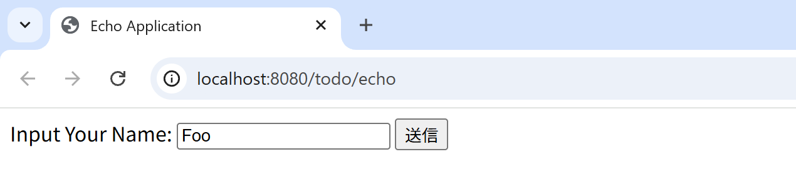
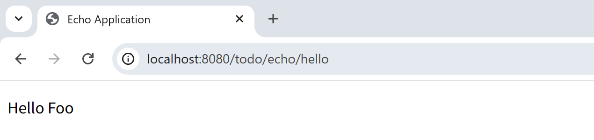
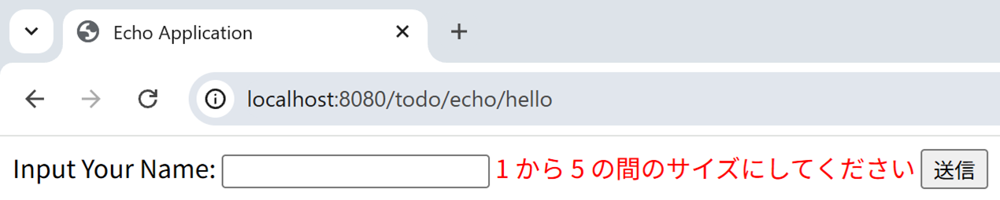
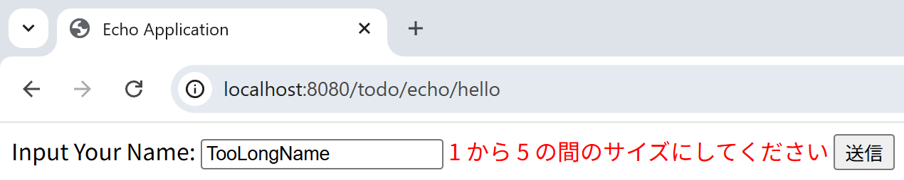

はじめてのSpring MVCアプリケーション
--------------------------------------------------------------

.. only:: html

.. contents:: 目次
  :depth: 3
  :local:

Spring MVCの、詳細な使い方の解説に入る前に、実際にSpring MVCに触れることで、Spring MVCを用いたWebアプリケーションの開発に対するイメージをつかむ。

|

検証環境
~~~~~~~~~~~~~~~~~~~~~~~~~~~~~~~~~~~~~~~~~~~~~~~~~~~~~~~~~~~~~~

本節の説明では、次の環境で動作検証している。(他の環境で実施する際は、本書をベースに適宜読み替えて設定していくこと。)

.. tabularcolumns:: |p{0.25\linewidth}|p{0.75\linewidth}|
.. list-table::
  :header-rows: 1
  :widths: 25 75

  * - 種別
    - プロダクト
  * - OS
    - Windows 11
  * - JVM
    - \ :url_redhat_openjdk:`Java <>`\  17
  * - IDE
    - \ :url_spring_io:`Spring Tool Suite </tools>`\  |sts_version| (以降「STS」と呼ぶ。設定方法は\ :doc:`../Appendix/SpringToolSuite`\ を参照されたい。)
  * - Build Tool
    - \ :url_maven:`Apache Maven </download.cgi>`\  |maven_version| (以降「Maven」と呼ぶ)
  * - Application Server
    - \ :url_tomcat:`Apache Tomcat </index.html>`\  |tomcat_version|
  * - Web Browser
    - \ :url_chrome:`Google Chrome </>`\  |chrome_version|

.. note::

  インターネット接続するためにプロキシサーバーを介する必要がある場合は、\ :ref:`STSのProxy設定<SpringToolSuiteInstallingPlugin>`\ と\ :url_maven:`MavenのProxy設定 </guides/mini/guide-proxies.html>`\ が必要である。

|

新規プロジェクト作成
~~~~~~~~~~~~~~~~~~~~~~~~~~~~~~~~~~~~~~~~~~~~~~~~~~~~~~~~~~~~~~
新規プロジェクト作成手順については、\ :ref:`BlankProjectCreateBlankProject`\ のシングルプロジェクトの「O/R Mapperに依存しないプロジェクトを生成するためのArchetype」を参照されたい。

サーバーを起動する
~~~~~~~~~~~~~~~~~~~~~~~~~~~~~~~~~~~~~~~~~~~~~~~~~~~~~~~~~~~~~~
サーバーを起動する手順については、\ :ref:`BlankProjectVerifyOperationOfBlankProject`\ を参照されたい。

.. _first-application-create-an-echo-application:

エコーアプリケーションの作成
~~~~~~~~~~~~~~~~~~~~~~~~~~~~~~~~~~~~~~~~~~~~~~~~~~~~~~~~~~~~~~
続いて、簡単なアプリケーションを作成する。作成するのは、次の図のようなテキストフィールドに、名前を入力すると
メッセージを表示する、いわゆるエコーアプリケーションである。

|

フォームオブジェクトの作成
^^^^^^^^^^^^^^^^^^^^^^^^^^^^^^^^^^^^^^^^^^^^^^^^^^^^^^^^^^^^^^
| まずは、テキストフィールドの値を受け取るための、フォームオブジェクトを作成する。
| \ ``com.example.todo.app.echo``\ パッケージに\ ``EchoForm``\ クラスを作成する。プロパティを1つだけ持つ、単純なJavaBeanである。

.. code-block:: java

  package com.example.todo.app.echo;

  import java.io.Serializable;

  public class EchoForm implements Serializable {

      private static final long serialVersionUID = 1L;

      private String name;

      public void setName(String name) {
          this.name = name;
      }

      public String getName() {
          return name;
      }
  }

|

Controllerの作成
^^^^^^^^^^^^^^^^^^^^^^^^^^^^^^^^^^^^^^^^^^^^^^^^^^^^^^^^^^^^^^
次に、Controller(\ ``com.example.todo.app.echo.EchoController``\ )クラスを作成する。

.. code-block:: java

  package com.example.todo.app.echo;

  import org.springframework.stereotype.Controller;
  import org.springframework.ui.Model;
  import org.springframework.web.bind.annotation.GetMapping;
  import org.springframework.web.bind.annotation.ModelAttribute;
  import org.springframework.web.bind.annotation.PostMapping;
  import org.springframework.web.bind.annotation.RequestMapping;

  @Controller
  @RequestMapping("echo") // (1)
  public class EchoController {

      @ModelAttribute // (2)
      public EchoForm setUpEchoForm() {
          EchoForm form = new EchoForm();
          return form;
      }

      @GetMapping // (3)
      public String index(Model model) {
          return "echo/index"; // (4)
      }

      @PostMapping(value = "hello") // (5)
      public String hello(EchoForm form, Model model) {// (6)
          model.addAttribute("name", form.getName()); // (7)
          return "echo/hello";
      }
  }

.. tabularcolumns:: |p{0.10\linewidth}|p{0.90\linewidth}|
.. list-table::
  :header-rows: 1
  :widths: 10 90

  * - 項番
    - 説明
  * - | (1)
    - | Controllerクラスに\ ``@RequestMapping``\ を付与した場合、該当のクラスのルートパスは"\ ``<contextPath> + / + value属性の値``\ "となる。
      | 本実装例では\ ``<contextPath>/echo``\ がControllerクラスのルートパスとなる。
      | Controllerクラスに\ ``@RequestMapping``\ を付与していない場合、該当のクラスのルートパスは"\ ``<contextPath>``\ "となる。
  * - | (2)
    - | \ ``@ModelAttribute``\ というアノテーションを、メソッドに付加する。このアノテーションがついたメソッドの返り値は、自動でModelに追加される。
      | Modelの属性名を、\ ``@ModelAttribute``\ で指定することもできるが、デフォルトでは、クラス名の先頭を小文字にした値が、属性名になる。この場合は、\ ``echoForm``\ である。フォームの属性名は、次に説明する\ ``form:form タグ``\ の\ ``modelAttribute``\ 属性の値に一致している必要がある。
  * - | (3)
    - | メソッドに\ ``@GetMapping``\ を付与した場合、メソッドへのマッピングは"\ ``クラスのルートパス + / + value属性の値``\ "となる。
      | 本実装例では\ ``value``\ 属性に何も指定していないため、"\ ``クラスのルートパス（<contextPath>/echo）``\ "にGETメソッドでアクセスすると\ ``index``\ メソッドが呼ばれるようになる。
  * - | (4)
    - | View名で"\ ``echo/index``\ "を返すので、ViewResolverにより、"\ ``WEB-INF/views/echo/index.jsp``\ "がレンダリングされる。
  * - | (5)
    - | メソッドに\ ``@PostMapping``\ を付与した場合、メソッドへのマッピングは"\ ``クラスのルートパス + / + value属性の値``\ "となる。
      | 本実装例では\ ``value``\ 属性の値に\ ``hello``\ を指定しているため、"\ ``クラスのルートパス + value属性の値（<contextPath>/echo/hello）``\ "にPOSTメソッドでアクセスすると\ ``hello``\ メソッドが呼ばれるようになる。
  * - | (6)
    - | 引数に、EchoFormには(1)によりModelに追加されたEchoFormオブジェクトが渡される。
  * - | (7)
    - | フォームで入力された\ ``name``\ を、Viewにそのまま渡す。

.. note::

  \ ``@GetMapping``\ アノテーションもしくは\ ``@PostMapping``\ アノテーションをメソッドに指定する場合は、クライアントから送信されたデータの扱い方によって変えるのが一般的である。

  * データをサーバに保存する場合(更新系の処理の場合)は、\ ``@PostMapping``\ アノテーション（POSTメソッド）。
  * データをサーバに保存しない場合(参照系の処理の場合)は、\ ``@GetMapping``\ アノテーション（GETメソッド）。

  エコーアプリケーションでは、

  * \ ``index``\ メソッドはデータをサーバに保存しない処理なのでGETメソッド\ ``@GetMapping``\ アノテーション
  * \ ``hello``\ メソッドはデータを\ ``Model``\ オブジェクトに保存する処理なので\ ``@PostMapping``\ アノテーション

  を指定している。

|

Viewの作成
^^^^^^^^^^^^^^^^^^^^^^^^^^^^^^^^^^^^^^^^^^^^^^^^^^^^^^^^^^^^^^
最後に、入力画面と、出力画面のViewを作成する。それぞれのファイルパスは、View名に合わせて、次のようになる。

.. tabs::
  .. group-tab:: JSP

    入力画面 (\ ``src/main/webapp/WEB-INF/views/echo/index.jsp``\ ) を作成する。
    
    .. code-block:: jsp
    
      <!DOCTYPE html>
      <html>
          <head>
              <title>Echo Application</title>
          </head>
          <body>
              <%-- (1) --%>
              <form:form modelAttribute="echoForm" action="${pageContext.request.contextPath}/echo/hello">
                  <form:label path="name">Input Your Name:</form:label>
                  <form:input path="name" />
                  <input type="submit" />
              </form:form>
          </body>
      </html>
    
    .. tabularcolumns:: |p{0.10\linewidth}|p{0.90\linewidth}|
    .. list-table::
      :header-rows: 1
      :widths: 10 90
    
      * - 項番
        - 説明
      * - | (1)
        - | タグライブラリを利用し、HTMLフォームを構築している。\ ``modelAttribute``\ 属性に、Controllerで用意したフォームオブジェクトの名前を指定する。
          | タグライブラリは\ :url_spring_reference:`Spring Framework Documentation -The Form Tag- </web/webmvc-view/mvc-jsp.html#mvc-view-jsp-formtaglib-formtag>`\ を参照されたい。

    .. note::
    
      \ ``<form:form>``\ タグの\ ``method``\ 属性を省略した場合は、POSTメソッドが使用される。

    出力されるHTMLは、
    
    .. code-block:: html
    
      <!DOCTYPE html>
      <html>
          <head>
              <title>Echo Application</title>
          </head>
          <body>
              <form id="echoForm" action="/todo/echo/hello" method="post">
                  <label for="name">Input Your Name:</label>
                  <input id="name" name="name" type="text" value="" />
                  <input type="submit" />
                  <input type="hidden" name="_csrf" value="LTH-77MOCsDmzZ6emzXQ1yehUN_x649j3SHgZ3p4bO8J8HLvGlTO2oNsb_bL-vv7_Rjk70bDfb3F3rdOuBKDBkJOCNs4k0uJ" />
              </form>
          </body>
      </html>
    
    となる。
    
    |
    
    出力画面 (\ ``src/main/webapp/WEB-INF/views/echo/hello.jsp``\ ) を作成する。
    
    .. code-block:: jsp
    
      <!DOCTYPE html>
      <html>
          <head>
              <title>Echo Application</title>
          </head>
          <body>
              
Hello <c:out value="${name}" /> <%-- (2) --%>

          </body>
      </html>
    
    .. tabularcolumns:: |p{0.10\linewidth}|p{0.90\linewidth}|
    .. list-table::
      :header-rows: 1
      :widths: 10 90
    
      * - 項番
        - 説明
      * - | (2)
        - | Controllerから渡された\ ``name``\ を出力する。\ ``c:out``\ タグにより、XSS対策を行っている。
    
    .. note::
    
      ここではXSS対策を標準タグの\ ``c:out``\ で実現したが、より容易に使用できる\ ``f:h()``\ 関数を共通ライブラリで用意している。
    
      詳細は、\ :doc:`../Security/XSS`\ を参照されたい。

  .. group-tab:: Thymeleaf

    入力画面 (\ ``src/main/webapp/WEB-INF/views/echo/index.html``\ ) を作成する。
    
    .. code-block:: html
    
      <!DOCTYPE html>
      <html xmlns:th="http://www.thymeleaf.org"> <!--/* (1) */-->
          <head>
              <title>Echo Application</title>
          </head>
          <body>
              <!--/* (2) */-->
              <form th:object="${echoForm}" th:action="@{/echo/hello}" method="post">
                  <label for="name">Input Your Name:</label>
                  <input th:field="*{name}" /> <!--/* (3) */-->
                  <input type="submit" />
              </form>
          </body>
      </html>
    
    .. tabularcolumns:: |p{0.10\linewidth}|p{0.90\linewidth}|
    .. list-table::
      :header-rows: 1
      :widths: 10 90
    
      * - 項番
        - 説明
      * - | (1)
        - | スタンダードダイアレクトが提供する属性を使用したとき、EclipseなどのIDEでの警告を抑止するため、ネームスペースを付与する。
      * - | (2)
        - | Thymeleafの属性を利用し、HTMLフォームを構築している。\ ``th:object``\ 属性に、Controllerで用意したフォームオブジェクトの名前を指定する。
          | また、ThymeleafのリンクURL式\ ``@{}``\ に "\ ``/``\ "から始まるパスを記述することでコンテキスト相対パスが生成され、\ ``th:action``\ 属性に指定できる。
          | これらの属性の詳細については\ :url_thymeleaf_tutorial:`Tutorial: Thymeleaf + Spring -Creating a Form- </thymeleafspring.html#creating-a-form>`\ を参照されたい。
      * - | (3)
        - | Thymeleaf + Springで提供される\ ``th:field``\ 属性を用いて、特定のプロパティをHTML formにバインドすることができる。
          | \ ``th:field``\ 属性は\ ``id``\ 属性、\ ``name``\ 属性、\ ``value``\ 属性をHTMLに出力し、\ ``id``\ 属性、\ ``name``\ 属性にはプロパティ名が出力される。
          | \ ``th:field``\ 属性の詳細については、\ :doc:`アプリケーション層の実装 <../ImplementationAtEachLayer/ApplicationLayer>`\ を参照されたい。

    .. note::
    
        \ ``<form>``\ タグの\ ``method``\ 属性を省略した場合は、\ **GETメソッドが使用される。**\

    出力されるHTMLは、
    
    .. code-block:: html
    
      <!DOCTYPE html>
      <html>
          <head>
              <title>Echo Application</title>
          </head>
          <body>
              <form action="/todo/echo/hello" method="post">
                  <input type="hidden" name="_csrf" value="LTH-77MOCsDmzZ6emzXQ1yehUN_x649j3SHgZ3p4bO8J8HLvGlTO2oNsb_bL-vv7_Rjk70bDfb3F3rdOuBKDBkJOCNs4k0uJ" />
                  <label for="name">Input Your Name:</label>
                  <input id="name" name="name" value="" />
                  <input type="submit" />
              </form>
          </body>
      </html>
    
    となる。
    
    |
    
    出力画面 (\ ``src/main/webapp/WEB-INF/views/echo/hello.html``\ ) を作成する。
    
    .. code-block:: html
    
      <!DOCTYPE html>
      <html xmlns:th="http://www.thymeleaf.org">
          <head>
              <title>Echo Application</title>
          </head>
          <body>
              

 <!--/* (4) */-->
          </body>
      </html>
    
    .. tabularcolumns:: |p{0.10\linewidth}|p{0.90\linewidth}|
    .. list-table::
      :header-rows: 1
      :widths: 10 90
    
      * - 項番
        - 説明
      * - | (4)
        - | Controllerから渡された\ ``name``\ を出力する。\ ``th:text``\ 属性により、XSS対策を行っている。

| これでエコーアプリケーションの実装は完了である。
| サーバーを起動し、\ :url_localhost:`/todo/echo`\ にアクセスするとフォームが表示される。

|

入力チェックの実装
^^^^^^^^^^^^^^^^^^^^^^^^^^^^^^^^^^^^^^^^^^^^^^^^^^^^^^^^^^^^^^
| ここまでのアプリケーションでは、入力チェックを行っていない。
| Spring MVCでは、\ :url_bean_validation:`Bean Validation <>`\ をサポートしており、アノテーションベースな入力チェックを、簡単に実装することができる。
| 例として、エコーアプリケーションで名前の入力チェックを行う。

\ ``EchoForm``\ の\ ``name``\ フィールドに、入力チェックルールを指定するアノテーションを付与する。

.. code-block:: java

  package com.example.todo.app.echo;

  import java.io.Serializable;
  import jakarta.validation.constraints.NotNull;
  import jakarta.validation.constraints.Size;

  public class EchoForm implements Serializable {

      private static final long serialVersionUID = 1L;

      @NotNull // (1)
      @Size(min = 1, max = 5) // (2)
      private String name;

      public void setName(String name) {
          this.name = name;
      }

      public String getName() {
          return name;
      }
  }

.. tabularcolumns:: |p{0.10\linewidth}|p{0.90\linewidth}|
.. list-table::
  :header-rows: 1
  :widths: 10 90

  * - 項番
    - 説明
  * - | (1)
    - | \ ``@NotNull``\ アノテーションをつけることで、HTTPリクエスト中に\ ``name``\ パラメータがあることを確認する。
  * - | (2)
    - | \ ``@Size(min = 1, max = 5)``\ をつけることで、\ ``name``\ のサイズが、1以上5以下であることを確認する。

|

入力チェックが実行されるように修正し、入力チェックでエラーが発生した場合の処理を実装する。

.. code-block:: java

  package com.example.todo.app.echo;

  import org.springframework.stereotype.Controller;
  import org.springframework.ui.Model;
  import org.springframework.validation.BindingResult;
  import org.springframework.validation.annotation.Validated;
  import org.springframework.web.bind.annotation.GetMapping;
  import org.springframework.web.bind.annotation.ModelAttribute;
  import org.springframework.web.bind.annotation.PostMapping;
  import org.springframework.web.bind.annotation.RequestMapping;

  @Controller
  @RequestMapping("echo")
  public class EchoController {

      @ModelAttribute
      public EchoForm setUpEchoForm() {
          EchoForm form = new EchoForm();
          return form;
      }

      @GetMapping
      public String index(Model model) {
          return "echo/index";
      }

      @PostMapping(value = "hello")
      public String hello(@Validated EchoForm form, BindingResult result, Model model) { // (1)
          if (result.hasErrors()) { // (2)
              return "echo/index";
          }
          model.addAttribute("name", form.getName());
          return "echo/hello";
      }
  }

.. tabularcolumns:: |p{0.10\linewidth}|p{0.90\linewidth}|
.. list-table::
  :header-rows: 1
  :widths: 10 90

  * - 項番
    - 説明
  * - | (1)
    - | コントローラー側には、Validation対象の引数に\ ``@Validated``\ アノテーションを付加し、\ ``BindingResult``\ オブジェクトを引数に追加する。
      | Bean Validationによる入力チェックは、自動で行われる。結果は、\ ``BindingResult``\ オブジェクトに渡される。
  * - | (2)
    - | \ ``hasErrors``\ メソッドを実行して、エラーがあるかどうかを確認する。入力エラーがある場合は、入力画面を表示するためのView名を返却する。

|

入力画面に、入力エラーのメッセージを表示するための実装を追加する。

.. tabs::
  .. group-tab:: JSP

    * \ ``src/main/webapp/WEB-INF/views/echo/index.jsp``\
    
    .. code-block:: jsp
    
      <!DOCTYPE html>
      <html>
          <head>
              <title>Echo Application</title>
          </head>
          <body>
              <form:form modelAttribute="echoForm" action="${pageContext.request.contextPath}/echo/hello">
                  <form:label path="name">Input Your Name:</form:label>
                  <form:input path="name" />
                  <form:errors path="name" cssStyle="color:red" /><%-- (1) --%>
                  <input type="submit" />
              </form:form>
          </body>
      </html>
    
    .. tabularcolumns:: |p{0.10\linewidth}|p{0.90\linewidth}|
    .. list-table::
      :header-rows: 1
      :widths: 10 90
    
      * - 項番
        - 説明
      * - | (1)
        - | 入力画面には、エラーがあった場合に、エラーメッセージを表示するため、\ ``form:errors``\ タグを追加する。

    出力されるHTMLは、
    
    .. code-block:: html
    
      <!DOCTYPE html>
      <html>
          <head>
              <title>Echo Application</title>
          </head>
          <body>
              <form id="echoForm" action="/todo/echo/hello" method="post">
                  <label for="name">Input Your Name:</label>
                  <input id="name" name="name" type="text" value="" />
                  size must be between 1 and 5
                  <input type="submit" />
                  

                      <input type="hidden" name="_csrf" value="LTH-77MOCsDmzZ6emzXQ1yehUN_x649j3SHgZ3p4bO8J8HLvGlTO2oNsb_bL-vv7_Rjk70bDfb3F3rdOuBKDBkJOCNs4k0uJ" />
                  

              </form>
          </body>
      </html>
    
    となる。

  .. group-tab:: Thymeleaf

    * \ ``src/main/webapp/WEB-INF/views/echo/index.html``\
    
    .. code-block:: html
    
      <!DOCTYPE html>
      <html xmlns:th="http://www.thymeleaf.org">
          <head>
              <title>Echo Application</title>
          </head>
          <body>
              <form th:object="${echoForm}" th:action="@{/echo/hello}" method="post">
                  <label for="name">Input Your Name:</label>
                  <input th:field="*{name}" />
                   <!--/* (1) */-->
                  <input type="submit" />
              </form>
          </body>
      </html>
    
    .. tabularcolumns:: |p{0.10\linewidth}|p{0.90\linewidth}|
    .. list-table::
      :header-rows: 1
      :widths: 10 90
    
      * - 項番
        - 説明
      * - | (1)
        - | 入力画面には、エラーがあった場合に、エラーメッセージを表示するため、 ``th:errors`` 属性を追加する。

    出力されるHTMLは、
    
    .. code-block:: html
    
      <!DOCTYPE html>
      <html>
      <head>
      <title>Echo Application</title>
      </head>
      <body>
          <form action="/todo/echo/hello" method="post">
              <input type="hidden" name="_csrf" value="LTH-77MOCsDmzZ6emzXQ1yehUN_x649j3SHgZ3p4bO8J8HLvGlTO2oNsb_bL-vv7_Rjk70bDfb3F3rdOuBKDBkJOCNs4k0uJ">
              <label for="name">Input Your Name:</label>
              <input id="name" name="name" value="">
              size must be between 1 and 5
              <input type="submit">
          </form>
      </body>
      </html>
    
    となる。

| 以上で、入力チェックの実装は完了である。
| 実際に、次のような場合、エラーメッセージが表示される。

* 名前を空にして送信した場合
* 5文字より大きいサイズで送信した場合

|

まとめ
^^^^^^^^^^^^^^^^^^^^^^^^^^^^^^^^^^^^^^^^^^^^^^^^^^^^^^^^^^^^^^

この章では、

#. \ ``mvn archetype:generate``\ を利用したブランクプロジェクトの作成方法
#. Spring MVCの基本的な設定方法
#. 最も簡易な、画面遷移方法
#. 画面間での値の引き渡し方法
#. シンプルな入力チェック方法

を学んだ。

上記の内容が理解できていない場合は、もう一度、本節を読み、環境構築から始めて、進めていくことで理解が深まる。

.. raw:: latex

  \newpage
