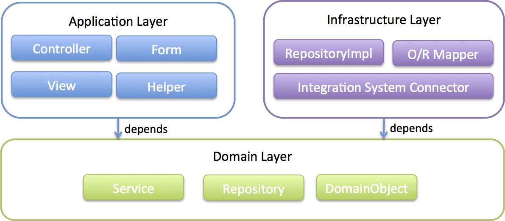

単体テスト概要
================================================================================

.. only:: html

.. contents:: 目次
   :local:

|

はじめに
--------------------------------------------------------------------------------

本章では、\ |framework_name|\を使用したシステムにおける、JUnitを用いた単体テストについて提示する。

ここでの単体テストのスコープはレイヤまたはレイヤ間結合とし、テストに関するアクティビティのうち、テスト実装とテスト実施に関して解説する。なお、解説するテスト実装は参考例でありシステムの品質を保証するためのテスト方針については、別途検討いただきたい。

|

単体テストガイドラインが示すこと
--------------------------------------------------------------------------------

本章では、以下のOSSライブラリを使用したレイヤまたはレイヤ間のテスト実装方法について説明する。

|

単体テストで利用するOSSライブラリ構成
^^^^^^^^^^^^^^^^^^^^^^^^^^^^^^^^^^^^^^^^^^^^^^^^^^^^^^^^^^^^^^^^^^^^^^^^^^^^^^^^

テスティングフレームワーク
""""""""""""""""""""""""""""""""""""""""""""""""""""""""""""""""""""""""""""""""

Javaのテスティングフレームワークとして、\ :url_junit4:`JUnit </>`\ を使用する。

|

アサーション
""""""""""""""""""""""""""""""""""""""""""""""""""""""""""""""""""""""""""""""""

| アサーションに使用するライブラリとして\ :url_hamcrest:`Hamcrest </>`\ を使用する。
| JUnit4が標準でサポートしているアサーションライブラリである。

|

モック化
""""""""""""""""""""""""""""""""""""""""""""""""""""""""""""""""""""""""""""""""

テスト対象のメソッドが依存するクラスをモック化するためのライブラリとして\ :url_mockito:`Mockito </>`\ を使用する。

|

DIコンテナ
""""""""""""""""""""""""""""""""""""""""""""""""""""""""""""""""""""""""""""""""

テスト用のDIコンテナとして\ :url_spring_reference:`Spring TestのDI機能 </testing/integration.html#testing-fixture-di>`\ を使用する。

|

MVCフレームワーク
""""""""""""""""""""""""""""""""""""""""""""""""""""""""""""""""""""""""""""""""

テスト用のMVCフレームワークとして\ :url_spring_reference:`Spring MVC Test Framework </testing/mockmvc.html>`\ を使用する。

|

トランザクション管理
""""""""""""""""""""""""""""""""""""""""""""""""""""""""""""""""""""""""""""""""

テスト用のトランザクション管理として\ :url_spring_reference:`Spring Testのトランザクション管理機能 </testing/integration.html#testing-tx>`\ を使用する。

|

データアクセス
""""""""""""""""""""""""""""""""""""""""""""""""""""""""""""""""""""""""""""""""

テスト用のデータアクセスとして、Spring TestまたはDBUnitとSpring Test DBUnitを使用することを想定している。

* \ :url_spring_reference:`Spring Test </testing/introduction.html>`\

  * Spring Testは\ ``@Sql``\ アノテーションや\ ``JdbcTemplate``\ などを使用してSQLを発行する機能を提供している。

* \ :url_dbunit:`DBUnit </>`\ と\ :url_spring_test:`Spring Test DBUnit </>`\

  * | Spring Test DBUnitは、Spring Framework上でDBUnitを利用する際の支援ライブラリのため、DBUnitと組み合わせて使用する。
    | DBUnitの提供するデータベースのセットアップ、状態の検証などの機能をアノテーションベースで実装する機能を提供している。

|

単体テストで利用するOSSライブラリのバージョン
^^^^^^^^^^^^^^^^^^^^^^^^^^^^^^^^^^^^^^^^^^^^^^^^^^^^^^^^^^^^^^^^^^^^^^^^^^^^^^^^

単体テストで利用するOSSライブラリの一覧を以下に示す。

| なお、以下のOSSライブラリはあくまで一例であり、実際は業務要件に合わせたライブラリを検討いただきたい。
| 本章内のアプリケーション自体を動作させるために利用するOSSライブラリ一覧については、\ :ref:`frameworkstack_using_oss_version`\ を参照されたい。

以下のOSSライブラリの中で、特にSpring Test（MockMvc）、Mockitoの使い方については、\ :ref:`UsageOfLibraryForTest`\ で詳細を説明する。

.. tabularcolumns:: |p{0.20\linewidth}|p{0.25\linewidth}|p{0.20\linewidth}|p{0.15\linewidth}|p{0.20\linewidth}|
.. list-table::
  :header-rows: 1
  :widths: 20 25 20 15 20

  * - Type
    - GroupId
    - ArtifactId
    - Version
    - Spring Boot
  * - JUnit
    - junit
    - junit
    - |junit_version|
    - \*
  * - Hamcrest
    - org.hamcrest
    - hamcrest
    - |hamcrest_version|
    - \*
  * - Mockito
    - org.mockito
    - mockito-core
    - |mockito_version|
    - \*
  * - Spring Test
    - org.springframework
    - spring-test
    - |spring_version|
    - \*
  * - DBUnit
    - org.dbunit
    - dbunit
    - |dbunit_version|
    - \
  * - Spring Test DBUnit
    - com.github.springtestdbunit
    - spring-test-dbunit
    - |spring_test_dbunit_version|
    - \

.. note::

  Hamcrest 2.1より、\ ``hamcrest-core``\ と\ ``hamcrest-library``\ にあたるモジュールが\ ``hamcrest``\ に統合されたため、実施したいアサーションにより\ ``hamcrest-library``\ のような依存関係を追加する必要がなくなった。

  なお、Maven依存関係としては\ ``hamcrest-core``\ と\ ``hamcrest-library``\ を引き続き利用することができるが、実態としてはすべて\ ``hamcrest``\ を参照する形となる。

|

単体テストの実装
^^^^^^^^^^^^^^^^^^^^^^^^^^^^^^^^^^^^^^^^^^^^^^^^^^^^^^^^^^^^^^^^^^^^^^^^^^^^^^^^

| 単体テストは\ :ref:`ApplicationLayering`\ に沿った以下のレイヤ単位で実装している。レイヤまたはレイヤ間のテスト方法を\ :ref:`ImplementsOfTestByLayer`\ で説明する。
| レイヤ単位に当てはめられない共通機能や、機能特有のテスト方法は、\ :ref:`ImplementsOfTestByFunction`\ で説明する。

|

対象読者
--------------------------------------------------------------------------------

本章は、\ :ref:`TargetReadersOfThisDocument`\ に加えて以下の知識・経験があることを前提としている。

* JUnitを使用した単体テストを行ったことがある

|

単体テストの動作検証環境
--------------------------------------------------------------------------------

| 本章は、以下の環境で動作検証をしている。
| 他の環境で実施する際は、本章をベースに適宜読み替えること。

.. tabularcolumns:: |p{0.25\linewidth}|p{0.75\linewidth}|
.. list-table::
  :header-rows: 1
  :widths: 25 75

  * - 種別
    - 名前
  * - OS
    - Windows 11
  * - JVM
    - \ :url_redhat_openjdk:`Java <>`\  17
  * - IDE
    - \ :url_spring_io:`Spring Tool Suite </tools>`\  |sts_version| (以降「STS」と呼ぶ。設定方法は\ :doc:`../Appendix/SpringToolSuite`\ を参照されたい。)
  * - Build Tool
    - \ :url_maven:`Apache Maven </download.cgi>`\  |maven_version| (以降「Maven」と呼ぶ)
  * - RDBMS
    - \ :url_postgresql:`PostgreSQL </sql-insert.html>`\  |postgresql_version|

.. raw:: latex

  \newpage
